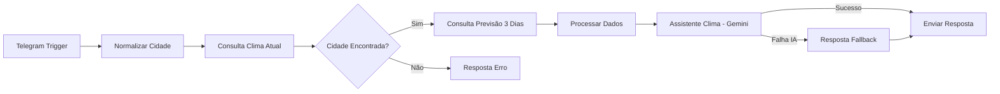

# Bot Clima Telegram

Chatbot para Telegram desenvolvido com **N8N** que informa a **temperatura atual** e a **previsão dos próximos 3 dias** para qualquer cidade do Brasil, utilizando a API do **OpenWeatherMap** e o **Google Gemini** para gerar respostas naturais e informativas.

## Arquitetura



### Fluxo Detalhado

| Etapa | Nó N8N | Descrição |
|-------|--------|-----------|
| 1 | Telegram Trigger | Recebe mensagem do usuário |
| 2 | Normalizar Cidade | Remove acentos, espaços e converte para minúsculas |
| 3 | Consulta Clima Atual | Chama OpenWeatherMap (`/weather`) com filtro Brasil |
| 4 | Cidade Encontrada? | Verifica se a API retornou dados válidos |
| 5 | Consulta Previsão 3 Dias | Chama OpenWeatherMap (`/forecast`) usando coordenadas |
| 6 | Processar Dados | Combina dados atuais + previsão, formata para a IA |
| 7 | Assistente Clima (Gemini) | Gera resposta amigável com emojis e dicas |
| 8 | Resposta Fallback | Mensagem formatada caso o Gemini falhe |
| 9 | Enviar Resposta | Envia resultado ao usuário no Telegram |

## Funcionalidades

- **Temperatura atual** com sensação térmica, umidade e velocidade do vento
- **Previsão de 3 dias** com temperaturas mínima e máxima
- **Respostas com IA** (Google Gemini) — mensagens naturais com emojis e dicas práticas
- **Fallback determinístico** — garante resposta mesmo se a IA estiver indisponível
- **Normalização de entrada** — trata acentos, espaços e capitalização
- **Filtro Brasil** — busca restrita a cidades brasileiras (`q=cidade,BR`)
- **Formatação Markdown** — respostas com destaque visual no Telegram

## Pré-requisitos

| Credencial | Onde obter | Custo |
|-----------|-----------|-------|
| **Token do Telegram Bot** | [@BotFather](https://t.me/botfather) no Telegram | Gratuito |
| **API Key OpenWeatherMap** | [openweathermap.org](https://openweathermap.org/api) | Gratuito (1.000 chamadas/dia) |
| **API Key Google Gemini** | [Google AI Studio](https://aistudio.google.com/) | Gratuito (tier free) |
| **Instância N8N** | [n8n.io](https://n8n.io/) (cloud ou self-hosted) | Free tier disponível |

## Como Configurar

### 1. Criar o Bot no Telegram

1. Abra o Telegram e busque por **@BotFather**
2. Envie `/newbot` e siga as instruções
3. Copie o **token** gerado (formato: `123456789:ABCdef...`)

### 2. Obter API Key do OpenWeatherMap

1. Crie uma conta em [openweathermap.org](https://openweathermap.org/)
2. Acesse **API Keys** no painel
3. Copie a chave gerada

### 3. Obter API Key do Google Gemini

1. Acesse [Google AI Studio](https://aistudio.google.com/)
2. Clique em **Get API Key** > **Create API Key**
3. Copie a chave gerada

### 4. Importar o Workflow no N8N

1. Abra sua instância do N8N
2. Clique em **"..."** (menu) > **Import from File**
3. Selecione o arquivo `workflow-bot-clima.json`
4. Configure as credenciais nos nós:

| Nó | Credencial |
|----|-----------|
| **Telegram Trigger** | Token do Bot (Telegram API) |
| **Consulta Clima Atual** | No campo `appid`, insira a API Key do OpenWeatherMap |
| **Consulta Previsão 3 Dias** | No campo `appid`, insira a mesma API Key do OpenWeatherMap |
| **Google Gemini Chat Model** | API Key do Google Gemini |

5. Clique em **"Active"** (canto superior direito) para ativar o workflow

## Como Usar

Abra a conversa com o bot no Telegram e envie o nome de qualquer cidade brasileira.

### Exemplo de Sucesso

**Usuário:** `Curitiba`

**Bot:**
> ⛅ **Curitiba**
>
> Agora está fazendo 18°C com sensação de 16°C. A umidade está em 72% e o vento sopra a 15.3 km/h.
>
> 📅 **Próximos dias:**
> ☁️ seg: 14°C ~ 20°C — nublado
> 🌦️ ter: 12°C ~ 18°C — chuva leve
> ☀️ qua: 15°C ~ 22°C — céu limpo
>
> 🧥 *Dica: leve um casaquinho, as noites estão frescas!*

### Exemplo de Erro

**Usuário:** `CidadeQueNaoExiste`

**Bot:**
> ❌ Cidade não encontrada.
>
> Digite o nome de uma cidade brasileira.
> Exemplos: São Paulo, Belo Horizonte, Manaus

## Estrutura do Repositório

```
bot-clima-telegram/
├── README.md                    # Documentação do projeto
└── workflow-bot-clima.json      # Workflow N8N (importável)
```

## APIs Utilizadas

| API | Endpoint | Finalidade |
|-----|----------|-----------|
| OpenWeatherMap | `/data/2.5/weather` | Temperatura atual, umidade, vento |
| OpenWeatherMap | `/data/2.5/forecast` | Previsão dos próximos dias (intervalos de 3h) |
| Google Gemini | via N8N LangChain | Geração de respostas naturais com IA |

---

**Desenvolvido por Fabiana Furtado — Pós-graduação em IA e Automação**
